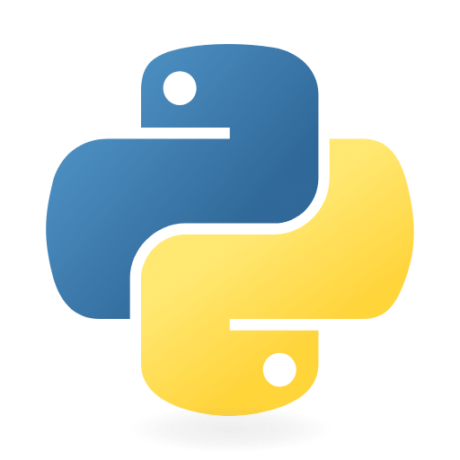
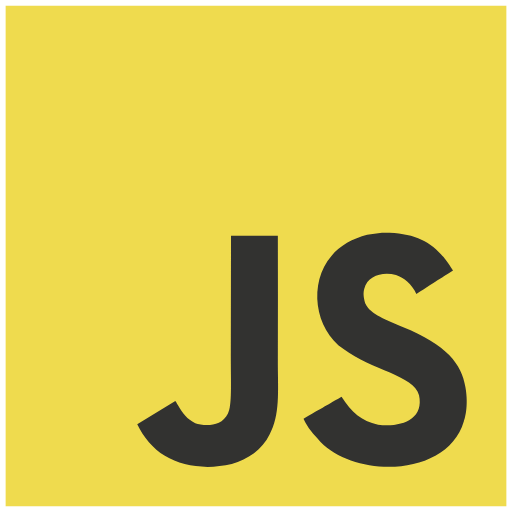
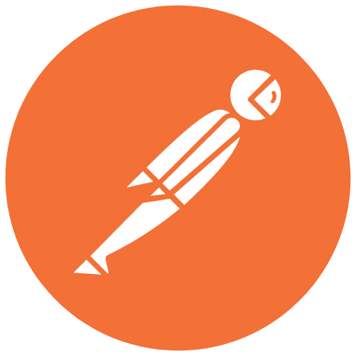

## 💜 Olá, meu nome é Rebecca Lelis!

## Sobre mim

- 🤔 Explorando novas tecnologias e desenvolvendo soluções de software.
- 🎓 Formada em Engenharia de Software e cursando pós graduação em Devops e Governança de dados.
- 💼 Trabalhando como Developer Fullstack .Net na Trinks.
- 🌱 Aprendendo mais sobre .Net e arquitetura.

## Onde me encontrar

## Experiência

Na visão geral abaixo você encontrará minha experiência de trabalho mais recente:

**Developer Fullstack .Net** \
[**Trinks**](https://www.trinks.com/) • Tempo integral \
Linguagens & Tecnologias:  `.Net`, `JavaScript`, `Rabbit`, `SqlServer`, `React`, `NHibernate`\
Projetos em destaque:
 
 

**Arquiteta de Sistema** \
[**LUDI**](https://www.linkedin.com/company/ludiufc/posts/?feedView=all) • Meio periódo \
Linguagens & Tecnologias: `Arquitetura do Sistema`, `Python`, `React`, `Docker`, `PostgreSQL`\
Projetos em destaque: Sistema DEIG Managaer, sistema que auxilia as empresas com as métricas em relação à diversidade, igualdade e inclusão interna 
 

**Desenvolvedor Fullstack Jr II - Publicador** \
[**Fitbank**](https://fitbank.com.br/) • Tempo integral \
Linguagens & Tecnologias: `.Net`, `JavaScript`, `Rabbit`, `SqlServer`, `Kubernetes`, `ElasticSearch`,\
Projetos em destaque: Leitura de Bloqueados OFAC e Validações de Risco em todo sistema de pagamentos
 

Por favor, encontre-me no [LinkedIn](https://www.linkedin.com/in/rebecca-lelis-928878222/) para uma descrição mais detalhada da minha experiência de trabalho, educação e certificação.

## Minhas Skills

### Back End

 

### Front End

 

### DevOps

 

### Banco de Dados
 

### Ferramentas de Desenvolvimento
 

 

<!--

## Onde me encontrar

 

*/
